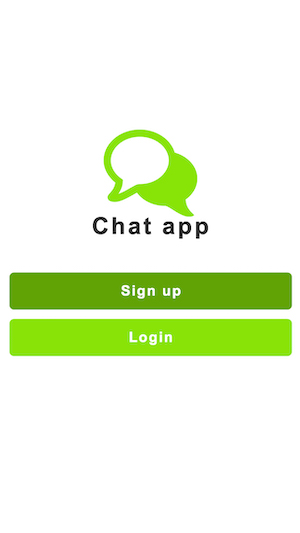
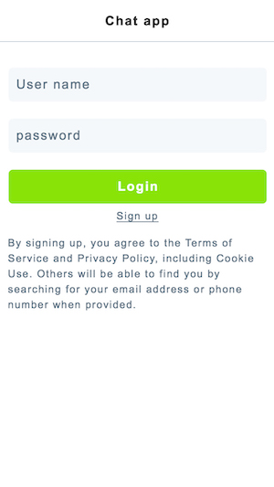
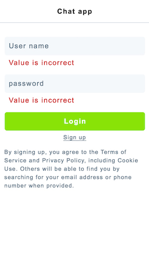
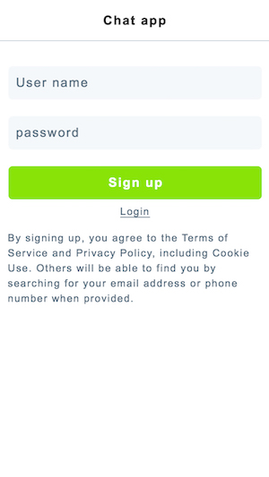
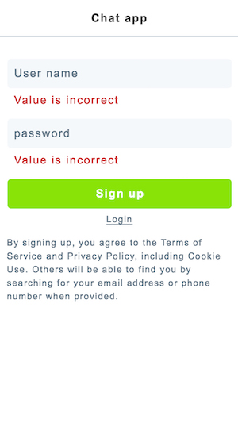
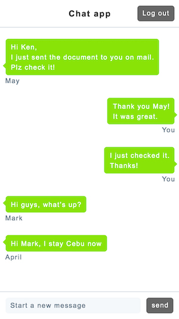

# LIG Chat App

## Overview

This is the simple chat application.
It is like Messanger in facebook and Direct message in twitter.

Regarding backend side like DB, you can take any implementation.
For example, you can use Baas like Firebase.

The interviewer will check your result by opening on Xcode or AndroidStudio.
So please implement taking the situation into your consideration.

The Chat room is only one.
And this app has no functionality for making rooms.
Any users will go to the chat room after login.

## Rules

+ Please use JAVA or Swift
+ You can use any libraries and frameworks
+ You cannot use any plugins

## Evaluation criterion

+ Any tiny difference from the design, even a few pixel difference, may cause a score deduction.
+ The implementation meets the specification or not
+ Readability and maintainability of the source code

## index

- "Sign up" button ... transfer to Sign up page
- "Login" button ... transfer to Login page

## Login

- If users click the button "Login" with correct values, the login will be succeeded and users transfer to chat page.
- Error cases are 3 patterns. But the error message is always same. (Please refer to "login-error.psd")
	1. If users click the button "Login" without any values, the error message will be shown.
	2. If users click the button "Login" with incorrect values, the error message will be shown.
	3. The number of characters in user name and password is 8 to 16. If inputed values by user doesn't follow it, the error message will be shown.
- The text "Sign up" with an underline is the link for transferring to Sign up page.

## Sign up

- If users click the button "Sign up" with correct values, the Sign up will be succeeded and users transfer to chat page. And the data of user name and password will be recorded to DB.
- Error cases are 3 patterns. And they are same to error messages in Login page.
- The text "Login" with an underline is the link for transferring to Login page.

## Chat specification

- Users can post a message by inputting text in the bottom input area and clicking the button "send".
- Each post has only 2 data. They are a message and user's name.
- The more a post is newer, it will come to the bottom.
- The more a post is older, it will come to the top.
- User's own post is always located the right side.
- Other member's post is always located the left side.
- When users click the button "Log out", they will log out and transfer to sign-up page.

## Featured List

1. **MVVM** Design Pattern
1. **Cocoapods** for some 3rd-party libraries
1. **Realm Database** for local persistent data storage
1. **Logging to XCode console** for easy debugging 

## XCode Project Initial Setup

1. **Install Cocoapods for library dependencies** `$ sudo gem install cocoapods`
1. Open terminal and go to project folder 
1. **Retrieve pods** for the project `$ pod install`
1. Open **.xcworkspace**
1. Recommend to use `iPhone SE` **device simulator** to test the app

## Testing the App

1. **Use existing credentials.** User name: **Evaluator**, password: **88888888**
1. **The app will remember logged-in user** after signup or login when terminated.

commit